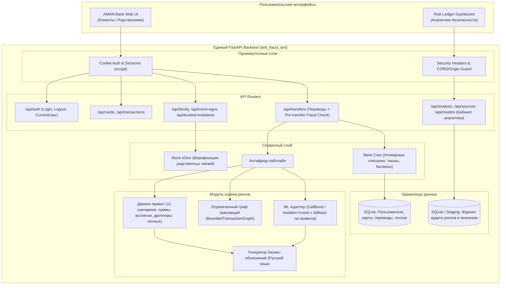

# Архитектура целевой системы (anti_fraud_arrt)

## 1. Концептуальная схема
Единый модульный backend обслуживает как операции клиентов банка (клиентский шлюз), так и рабочее место аналитика (аналитический шлюз).



---

## 2. Структура проекта в `anti_fraud_arrt`

```text
anti_fraud_arrt/
├── .agent/
│   └── skills/                         # Проектные навыки Antigravity
│       ├── project-integration/
│       ├── money-and-access/
│       └── antifraud-verification/
├── docs/                               # Контекст, архитектура, решения, прогресс
│   ├── project-context.md
│   ├── architecture.md
│   ├── integration-plan.md
│   ├── decisions.md
│   ├── testing.md
│   └── progress.md
├── backend/
│   ├── app/
│   │   ├── api/                        # API маршруты
│   │   │   ├── auth_routes.py
│   │   │   ├── bank_routes.py
│   │   │   ├── family_routes.py
│   │   │   ├── transfer_routes.py      # Включая pre-check и approve/reject
│   │   │   └── analyst_routes.py
│   │   ├── core/                       # Базовые настройки, безопасность, БД
│   │   │   ├── config.py
│   │   │   ├── database.py
│   │   │   └── security.py
│   │   ├── domain/                     # Схемы и модели
│   │   │   ├── models.py               # SQLAlchemy сущности
│   │   │   ├── schemas.py              # Pydantic схемы API
│   │   │   └── canonical.py            # Канонические признаки антифрода
│   │   ├── services/                   # Бизнес-логика
│   │   │   ├── bank_service.py
│   │   │   ├── family_service.py
│   │   │   ├── mock_egov.py
│   │   │   ├── fraud_detector.py       # Оркестратор антифрода
│   │   │   ├── transaction_rules.py    # Детерминированные правила
│   │   │   ├── transaction_graph.py    # Граф связей
│   │   │   └── explanations.py         # Объяснения факторов
│   │   ├── main.py                     # Единая точка входа FastAPI
│   │   ├── migrations.py               # Аддитивные миграции SQLite
│   │   └── seed.py                     # Тестовые данные (Амина, Марат, Алихан и др.)
│   ├── tests/
│   │   ├── unit/
│   │   ├── integration/
│   │   └── conftest.py
│   ├── requirements.txt
│   └── pyproject.toml
├── frontend/
│   ├── aman/                           # Клиентский мобильный веб-интерфейс
│   │   ├── index.html
│   │   ├── style.css
│   │   └── app.js
│   └── analyst/                        # Кабинет аналитика Risk Ledger (React/TS)
│       ├── src/
│       ├── package.json
│       └── vite.config.ts
├── data/                               # Датасеты и синтетические выборки
├── AGENTS.md                           # Главная инструкция для агентов
└── README.md
```

---

## 3. Границы модулей и контракты взаимодействия

### Модуль переводов и антифрода
1. При вызове `POST /api/transfers`:
   - Запрос проходит валидацию суммы и получателя.
   - Вызывается `FraudDetector.evaluate_transfer(...)`.
   - Если риск = `low` или `medium`: операция исполняется атомарно.
   - Если риск = `high` или `critical`:
     - Проверяется `TrustedPerson` отправителя.
     - Если защиты нет или родственник не принял приглашение -> отказ (`403` / `422` с понятным описанием причины).
     - Если защита активна -> создание транзакции в статусе `pending_approval`. Средства не списываются.
2. Подтверждение родственником:
   - Эндпоинт `POST /api/transfers/{id}/approve` доступен ТОЛЬКО аутентифицированному доверенному лицу.
   - При одобрении: выполняется атомарное списание с карты отправителя и зачисление получателю.
   - Эндпоинт `POST /api/transfers/{id}/reject`: перевод помечается `rejected`.
