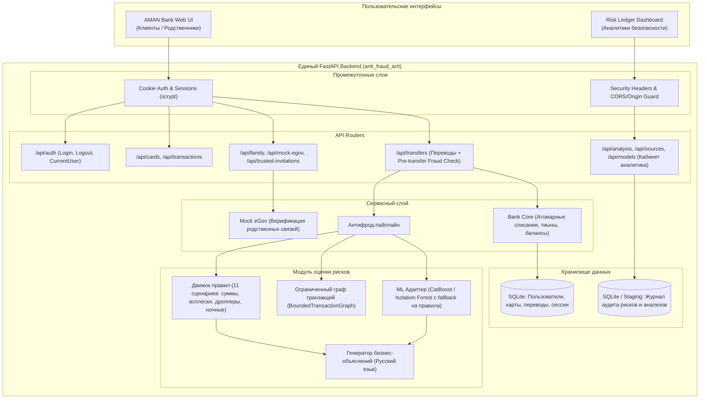

# Архитектура целевой системы (anti_fraud_arrt)

## Реализованное расширение 6.2–6.4

`TrustedInvitation.active` и `relationship_verified` хранят адресное назначение и подтверждённое родство. До трёх приглашений pending/accepted сосуществуют; `TrustedPerson` сохраняет глобальные настройки и совместимую сводку первого принятого родственника. Адресное удаление использует `ProtectionChangeRequest.invitation_id`; отдельные частичные уникальные индексы защищают повторные disable и remove.

`TransferParticipant` фиксирует участников конкретного рискованного перевода и неизменяемые ответы. `transfer_approval_service` сериализует создание, голоса и служебное решение через SQLite BEGIN IMMEDIATE. До всех ответов нет проводок. Единогласное approve исполняет перевод, reject отклоняет, смешанный набор переходит в bank_review. Проверяются все исходные приглашения; отзыв согласия не уменьшает кворум.

`TransferRequest.anti_scam_json` хранит три nullable boolean ответа отдельно от численного риска; ответы входят в проверку Idempotency-Key. `bank_review_reason` объясняет anti_scam либо conflicting_votes. Высокий риск с тревожным ответом сначала требует семейных ответов; без согласившегося родственника остаётся blocked_no_trusted. Низкий/средний риск с тревожным ответом направляется сотруднику напрямую.

`bank_event_routes` обслуживает GET /api/analyst/bank-events (status, sender_name, page, page_size), GET /{request_id}, POST /{request_id}/approve|reject с {note}. CurrentAnalyst проверяет серверную роль. BankReviewDecision фиксирует автора, основание и время с уникальностью на запрос. Аудит, состояние и проводки сохраняются одной транзакцией. Очередь не зависит от загрузки или ML; собственные импортированные анализы сохраняют изоляцию владельца.

Клиентский GET /api/trusted-invitations возвращает собственные приглашения; POST добавляет родственника. Адресное удаление: POST /api/protection-change-requests с {action:"remove", invitation_id}. Старые summary/current endpoints сохраняются. Миграция делает резервную копию и расширяет SQLite CHECK статусов transfer_requests с сохранением строк, ограничений и индексов; до commit выполняется foreign_key_check. Денежный журнал не используется как очередь согласования.

## 1. Концептуальная схема
Целевая архитектура: единый модульный backend обслуживает как операции клиентов банка, так и рабочее место аналитика. Схема ниже включает ещё не реализованные этапы. На этапе 2 переносится банковское ядро; аналитический шлюз и проверка риска перед переводом пока отсутствуют.



---

## 2. Структура проекта в `anti_fraud_arrt`

```text
anti_fraud_arrt/
├── .agent/
│   └── skills/                         # Проектные навыки Antigravity
│       ├── project-integration/
│       ├── money-and-access/
│       └── antifraud-verification/
├── docs/                               # Контекст, архитектура, решения, прогресс
│   ├── project-context.md
│   ├── architecture.md
│   ├── integration-plan.md
│   ├── decisions.md
│   ├── testing.md
│   └── progress.md
├── backend/
│   ├── app/
│   │   ├── api/                        # API маршруты
│   │   │   ├── auth_routes.py
│   │   │   ├── bank_routes.py
│   │   │   ├── family_routes.py
│   │   │   ├── transfer_routes.py      # Включая pre-check и approve/reject
│   │   │   └── analyst_routes.py
│   │   ├── core/                       # Базовые настройки, безопасность, БД
│   │   │   ├── config.py
│   │   │   ├── database.py
│   │   │   └── security.py
│   │   ├── domain/                     # Схемы и модели
│   │   │   ├── models.py               # SQLAlchemy сущности
│   │   │   ├── schemas.py              # Pydantic схемы API
│   │   │   └── canonical.py            # Канонические признаки антифрода
│   │   ├── services/                   # Бизнес-логика
│   │   │   ├── bank_service.py
│   │   │   ├── family_service.py
│   │   │   ├── mock_egov.py
│   │   │   ├── fraud_detector.py       # Оркестратор антифрода
│   │   │   ├── transaction_rules.py    # Детерминированные правила
│   │   │   ├── transaction_graph.py    # Граф связей
│   │   │   └── explanations.py         # Объяснения факторов
│   │   ├── main.py                     # Единая точка входа FastAPI
│   │   ├── migrations.py               # Аддитивные миграции SQLite
│   │   └── seed.py                     # Тестовые данные (Амина, Марат, Алихан и др.)
│   ├── tests/
│   │   ├── unit/
│   │   ├── integration/
│   │   └── conftest.py
│   ├── requirements.txt
│   └── pyproject.toml
├── frontend/
│   ├── aman/                           # Клиентский мобильный веб-интерфейс
│   │   ├── index.html
│   │   ├── style.css
│   │   └── app.js
│   └── analyst/                        # Кабинет аналитика Risk Ledger (React/TS)
│       ├── src/
│       ├── package.json
│       └── vite.config.ts
├── data/                               # Датасеты и синтетические выборки
├── AGENTS.md                           # Главная инструкция для агентов
└── README.md
```

---

## 3. Границы модулей и контракты взаимодействия

На этапе 2 фактически используются `app/api/{auth,bank,family,transfer}_routes.py`, `app/core/{database,security}.py`, `app/domain/{models,schemas}.py`, `app/services/{bank_service,family_service,mock_egov}.py`, `app/migrations.py`, `app/seed.py` и `app/main.py`. Никаких импортов из исходных проектов при запуске нет. AMAN раздаётся на `/` из `frontend/aman`. Рабочая SQLite находится в корне целевого проекта, тестовые базы — в отдельном временном каталоге. `/api/health` отличает готовность банка от отсутствующей аналитики.

Следующий контракт описывает будущую интеграцию; текущий `/api/transfers` пока исполняет учебный перевод сразу.

### Модуль переводов и антифрода
1. При вызове `POST /api/transfers`:
   - Запрос проходит валидацию суммы и получателя.
   - Вызывается `FraudDetector.evaluate_transfer(...)`.
   - Если риск = `low` или `medium`: операция исполняется атомарно.
   - Если риск = `high` или `critical`:
     - Проверяется `TrustedPerson` отправителя.
     - Если защиты нет или родственник не принял приглашение -> отказ (`403` / `422` с понятным описанием причины).
     - Если защита активна -> создание транзакции в статусе `pending_approval`. Средства не списываются.
2. Подтверждение родственником:
   - Эндпоинт `POST /api/transfers/{id}/approve` доступен ТОЛЬКО аутентифицированному доверенному лицу.
   - При одобрении: выполняется атомарное списание с карты отправителя и зачисление получателю.
   - Эндпоинт `POST /api/transfers/{id}/reject`: перевод помечается `rejected`.

## Реализованная аналитика этапа 3

api/risk_routes.py -> services/fraud_detector.py -> transaction_rules / BoundedTransactionGraph; domain/risk_schemas.py описывает публичный контракт. risk_explanations.py публикует только разрешённые числовые факты без идентификаторов других клиентов. transaction_features.py и transaction_model.py обслуживают офлайн-оценку с необязательным IsolationForest; training/ содержит перенесённые инструменты синтетики и обучения.

POST /api/transfers/risk-check — предварительная проверка с авторизацией, без изменения базы. Обычный перевод пока не вызывает антифрод автоматически. Детали временных границ, fallback и ограничений истории зафиксированы в ADR-008/009. Аналитический кабинет и batch upload остаются отдельной будущей частью переноса.

## Реализованный этап 4

POST /api/transfers -> transfer_approval_service.create_transfer -> FraudDetector -> TransferRequest и при разрешении bank_service.post_transfer. post_transfer не делает commit сам: статус запроса, условное списание, зачисление и обе проводки коммитятся одной транзакцией. BEGIN IMMEDIATE сериализует команды и решения; auth-загруженные ORM объекты обновляются после получения блокировки.

TransferRequest добавляется как новая таблица через create_all при старте, прежние ограничения transactions не меняются. Снимок risk_json и policy_json сохраняет момент оценки, численные риски/силы факторов, неопределённость, версии движка и политики; decided_at/decided_by_user_id — результат решения. Сырые идентификаторы графа не публикуются.

## Задержка ослабления семейной защиты (этап 6.1)

`services/protection_changes.py` управляет сохранёнными заявками `ProtectionChangeRequest`. Семейные маршруты предоставляют создание, собственную историю и отмену. Частичный уникальный индекс ограничивает одним ожидающим действием каждого типа на пользователя. При удалении проверяется снимок приглашения: прежняя заявка не удаляет новую связь.

До истечения 24 часов поля защиты не ослабляются. После срока отключается защита; при удалении дополнительно очищается назначение и сведения о родственнике. Приглашение сохраняется как история, но перестаёт давать полномочия. Изменение жизненного цикла фиксируется до финансовой команды, затем полномочия повторно проверяются под её блокировкой. Денежное исполнение не переносится в этот сервис. Внешний ML-сервис новой версии AMAN не подключается.

## Реализованный аналитический модуль этапа 5

`app/risk_ledger` содержит адаптеры, mapper, планировщик и аналитический runtime. API расположен под `/api/analyst`, React-сборка — под `/analyst/`; AMAN остаётся на `/`. API маршрутизируется перед статическими файлами. Отсутствие React-сборки возвращает диагностическую страницу 503 и не мешает банковскому ядру.

Общая сессия определяет аккаунт; серверная роль `client` разрешает банковские операции, `analyst` — аналитические. Пользователь не может назначить себе роль через API. Анализы имеют серверного владельца, чужие идентификаторы возвращают 404. Владелец сохраняется в метаданных и проверяется при восстановлении. Загрузка и расследование не изменяют банковскую SQLite.

Результаты и registry хранятся в `runtime/risk_ledger`, доверенные модельные артефакты — в `artifacts/risk_ledger`. Эти каталоги не обслуживаются статическим сервером. SQLite-выгрузки открываются только для чтения, SQL-выгрузки разбираются без исполнения. Транзакционные признаки, правила и граф используют общие исправленные модули. При отсутствии ML работает транзакционный fallback; клиентский профиль явно блокируется без модели. Исторические описания этапов 3–4 выше отражают состояние до этого переноса.

Собственные запросы и очередь родственника раздельны; интерфейс AMAN показывает фиксированные реквизиты, ожидание, отказ, причины риска и действия по правам. Истечение применяется при чтении/действии/повторе; отдельного фонового worker нет. Списки запросов пока без пагинации, и чтение для истечения получает блокировку SQLite; это ограничение локального прототипа. Текущие правила исполнения заменяют описанное выше историческое прямое исполнение этапа 2/3; контракт — ADR-010.
